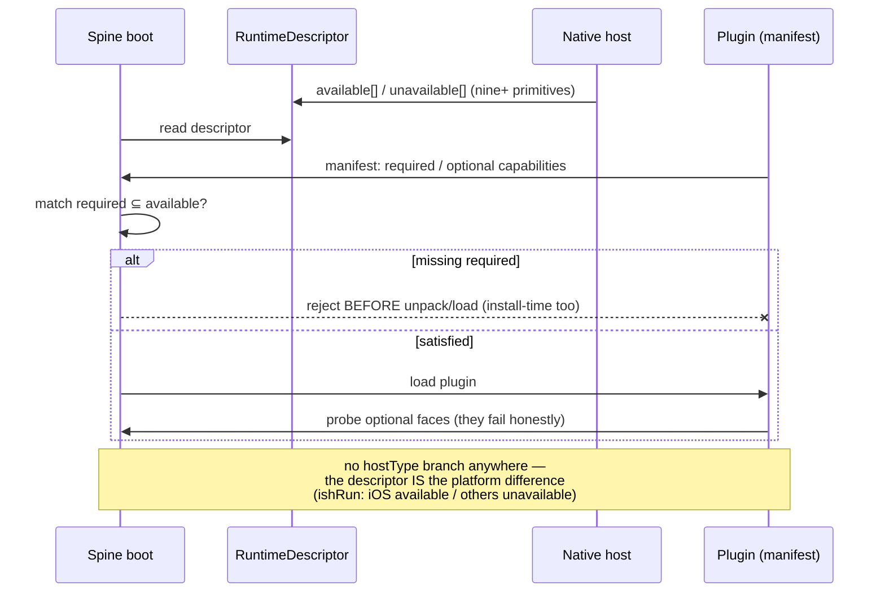
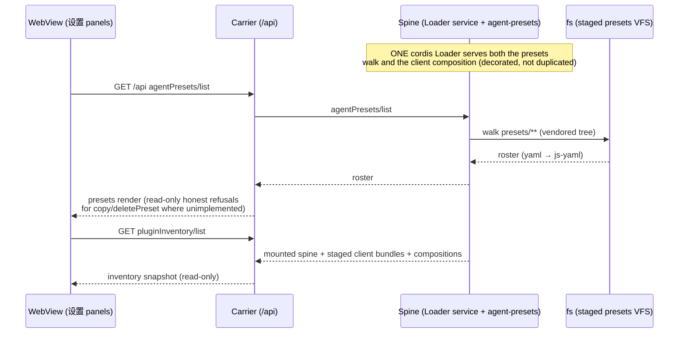
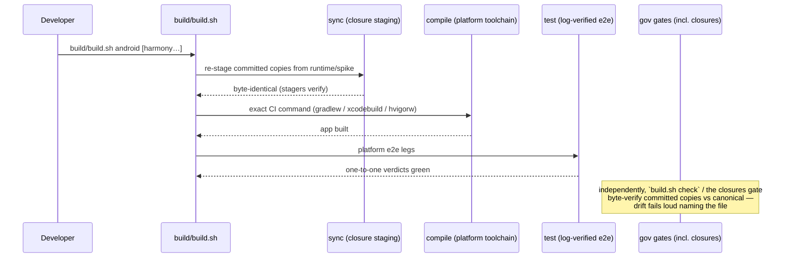

# Sequence diagrams — every flow, end to end

English | [简体中文](sequence-diagrams.zh.md)

The ten flows that make up dsh-mobile, as sequence diagrams. Participants are
the architecture's five layers (ARCHITECTURE.md §2): the **UI** (WebView
rendering a Web Client), the **carrier** (loopback HTTP/WS server inside the
app), the **spine** (QuickJS runtime carrying the vendored upstream DSH core,
one serial thread), the **gateway** (frozen primitive table + audit), and the
**native privileged layer** (Swift / Kotlin / ArkTS+NAPI). Every diagram also
marks where the structured log records land — they are the evidence the
e2e checker asserts on.

```mermaid
%% participant legend shared by all diagrams
```

## 1. App boot and the official Web Client mount

```mermaid
sequenceDiagram
    participant U as User
    participant N as Native shell (SwiftUI/Compose/ArkUI)
    participant H as C host + QuickJS spine
    participant S as Spine (boot.js → DSH core)
    participant C as Carrier (loopback HTTP/WS)
    participant W as WebView (official Web Client)

    U->>N: launch app
    N->>H: dsh_spike_new_declaring (bundle root)
    Note over H: launch env declared (host.launch record;<br/>iOS adds DSH_ISH_ROOTFS)
    N->>H: eval(upstream/boot.js)
    S->>S: mobile profile boot: cordis layers<br/>(dsh-base → host face → profile)
    S-->>N: runtime.created / gateway.negotiated (log)
    N->>C: start carrier on 127.0.0.1:<port>
    S->>S: web-boot composes official client-modules<br/>(facade queue → __DSH_BOOT__ wire)
    S->>C: web.boot / api.claim / mux.claim (bus seam)
    N->>W: load http://127.0.0.1:<port>
    W->>C: GET / (official dist)
    C-->>W: index + lazy /plugins bundles
    W->>C: WS connect (mux)
    C-->>W: token deltas / journal frames
    W-->>U: the app renders (official UI, live session)
```

Evidence: `boot.verification` (7 events), `officialweb.mount` (14 events),
screenshots at each stage under `hosts/<p>/artifacts/`.

## 2. A gateway primitive call (fsWrite as the example)

```mermaid
sequenceDiagram
    participant P as JS plugin / scenario
    participant G as Gateway (gateway.js)
    participant N as Native privileged layer
    participant A as Audit log
    participant Q as Runtime serial queue

    P->>G: fsWrite(scope, path, bytes)
    G->>G: permission check + typed signature
    alt denied
        G-->>P: structured denial (permission)
        G->>A: audit{primitive, denied}
    else allowed
        G->>Q: dispatch event
        Q->>N: primitive invoke (on the serial thread)
        N->>N: perform (Keychain / SAF / HUKS / file)
        N-->>Q: result
        Q-->>G: completion event
        G->>A: audit{primitive, outcome, bytes}
        G-->>P: result (or structured error)
    end
    Note over G,A: every call = one audit record;<br/>the audit stream is its own scenario (gateway.audit)
```

## 3. Capability negotiation (RuntimeDescriptor)



## 4. Live LLM streaming session

```mermaid
sequenceDiagram
    participant U as User
    participant W as WebView (composer)
    participant C as Carrier
    participant S as Spine (agent-loop → dsh-llm)
    participant G as Gateway
    participant N as Native (httpFetch)
    participant L as LLM backend (OpenAI-compatible)

    U->>W: type + send
    W->>C: POST /api/session/prompt
    C->>S: session/prompt (mux)
    S->>S: agent-loop turn; session journal append
    S->>G: httpFetch(stream, SSE)
    G->>N: primitive invoke
    N->>L: HTTPS request (key from sealed store)
    loop per SSE chunk
        L-->>N: delta (reasoning/content)
        N-->>G: body chunk event
        G-->>S: chunk
        S->>C: ws.token-delta {index}
        C-->>W: WS frame
        W-->>U: token renders (streaming)
    end
    L-->>N: [DONE]
    S->>C: ws.session-complete
    S-->>S: journal commit; key-leak audit over every log line
```

Evidence: `llm.live-stream` (+ `.device` legs): served model logged verbatim,
reasoning+content as event sequence, key-leak audit asserted.

## 5. Session persistence and resume

```mermaid
sequenceDiagram
    participant S as Spine
    participant F as fs primitives
    participant J as Journal (append-only JSONL)
    participant K as Checkpoint (event-queue drained)

    S->>J: append record (user/assistant/tool)
    J->>F: write sessions/<id>.jsonl
    Note over S,K: checkpoint = event queue drained<br/>(a quiet point, not a special case)
    S->>K: persist checkpoint state
    Note over S,K: suspension freezes; memory pressure kills —<br/>the journal survives, the live runtime does not
    S->>S: foreground: reconnect (client-connection<br/>reconnect semantics) + resume from checkpoint
    S->>J: session.list / journal read-back
```

## 6. Plugin install as a receipt transaction

```mermaid
sequenceDiagram
    participant S as Install pipeline (install-pipeline.js)
    participant B as Blob store (cache/blobs/<sha256>)
    participant T as Trust record + manifest validation
    participant P as Staging (plugins/<pkg>@<semver>)
    participant R as Receipt journal (append-only)

    S->>B: tgz bytes → content-addressed store
    B-->>S: digest match? (mismatch = reject pre-unpack)
    S->>T: verify trust + strict manifest + capability negotiation
    alt tampered or under-privileged
        T--xS: REJECT (nothing unpacked)
        S->>R: pending receipt → rolled-back state
    else verified
        S->>P: staged integrity read-back
        P-->>S: bytes verified
        S->>R: receipt COMMIT
        Note over R: startup replay: staged-verifies → committed;<br/>staging-incomplete → rolled back
    end
```

Evidence: `install.verified-tarball` (22/22), `install.full-cycle` (41/41),
`install.from-http` (46/46).

## 7. ishRun — the emulated userland, with per-boot integrity

```mermaid
sequenceDiagram
    participant P as Shell plugin (dsh-shell-ish)
    participant G as Gateway (ishRun)
    participant H as Host (dsh_ish)
    participant V as Verifier (dsh_ish_verify) [NEW]
    participant E as iSH engine (in-process)
    participant G2 as Guest Alpine userland

    Note over H,V: staging: rootfs extracted →<br/>manifest sealed (<rootfs>.manifest, sha256 per entry)
    P->>G: ishRun(command)
    G->>H: boot guest (under boot lock)
    H->>V: verify staged tree vs manifest
    alt digest mismatch (tamper/partial write)
        V--xH: REFUSED (expected vs actual named)
        H-->>G: structured error → audit
    else verified (~25ms warm)
        H->>E: boot (41–79ms measured)
        E->>G2: exec command (child of guest init)
        G2-->>E: stdout/stderr/exit (via zombie)
        E-->>H: result
        H-->>G: {exitCode, stdout}
        G-->>P: result + audit record
    end
    Note over H,V: guest ADDITIONS tolerated + counted<br/>(contract: installs persist);<br/>apk upgrade of a pinned member → refused at next boot
```

Evidence: `userland.shell` (11/11 + deliverable digest), plus the new
tamper-rejection case in `run-ish-local.sh`.

## 8. Settings surfaces — presets and plugin inventory



Evidence: `settings.surfaces` (CLI, one-to-one).

## 9. E2E verification — logs, not screenshots

```mermaid
sequenceDiagram
    participant R as Runner (run-*.sh)
    participant A as App on device/emulator
    participant L as Structured log stream (dsh.spike.log:)
    participant X as check.mjs
    participant M as Evidence dir (artifacts/)

    R->>A: install + launch (exactly once)
    A->>L: one envelope record per event<br/>{scenario, event, ...}
    R->>R: stream bounded at FIRST completion tag
    R->>X: manifest(scenario.json) + captured log
    X->>X: per line: prefix → JSON.parse → filter by scenario id
    X->>X: one-to-one ordered walk (missing/extra/parseError all fail)
    X-->>R: verdict {pass, expected, logged, failures[]}
    R->>M: logs + scenario.jsonl + verdict + screenshots (human-only)
    Note over X,M: failure report IS the diagnosis;<br/>provenance runId bound (CI refuses stale verdicts)
```

## 10. The build facade



## Reading guide

- Flows 1–8 are runtime behavior; 9–10 are the verification and build
  machinery that keep them honest.
- Every "log" note is a real record the checker can assert on; every diagram
  maps to at least one named scenario in the [verification stages table]
  (ARCHITECTURE.md §10).
- The one deliberate platform asymmetry (flow 7) is negotiated, never branched.
