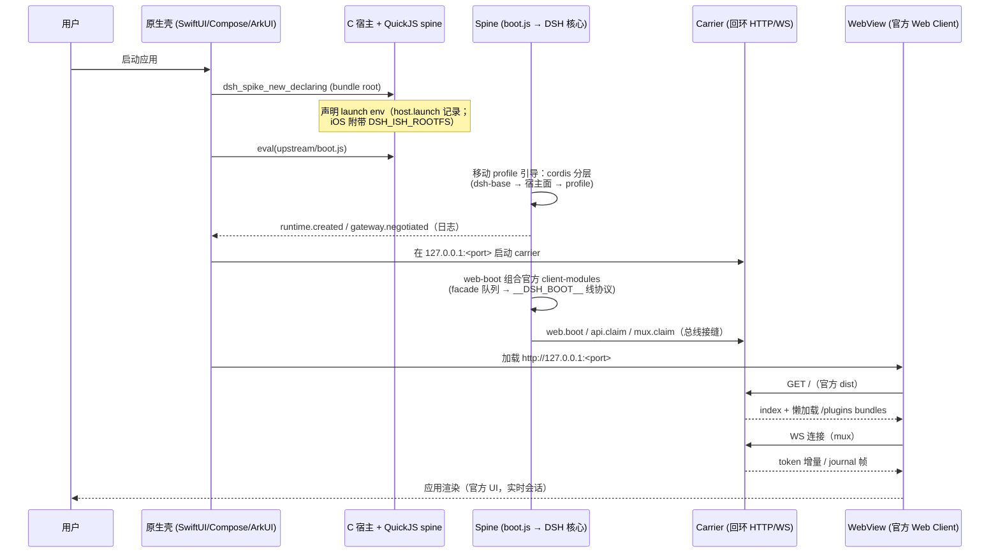
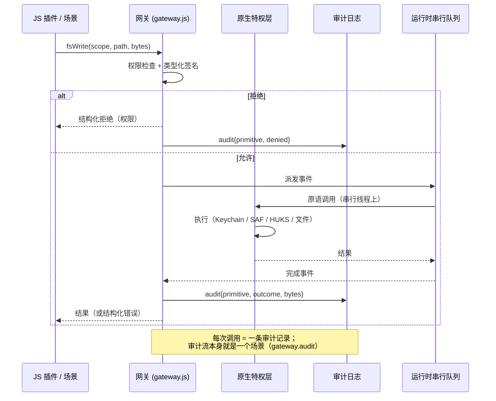
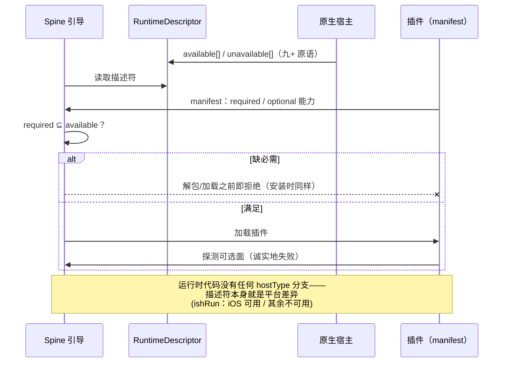
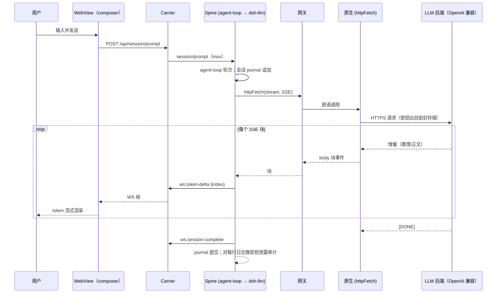
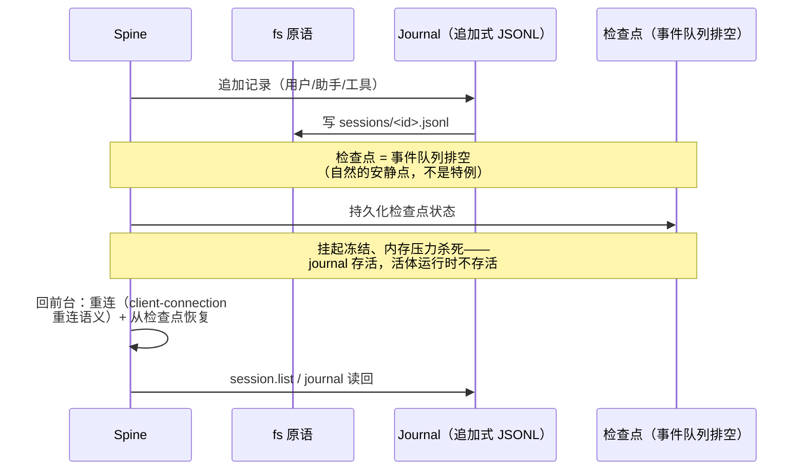
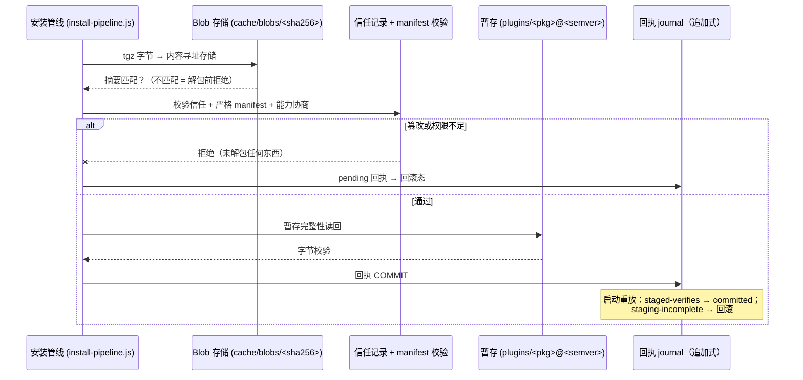
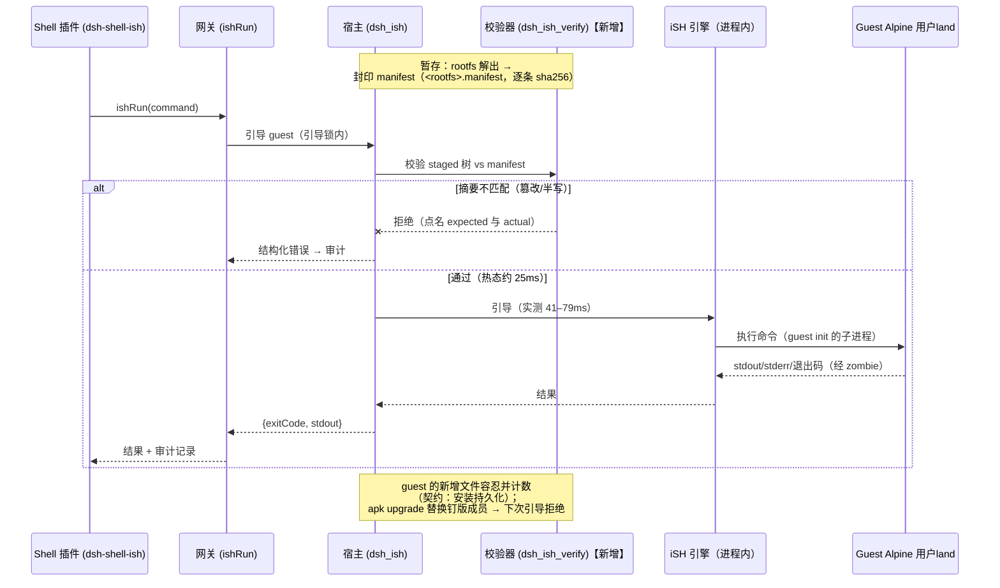
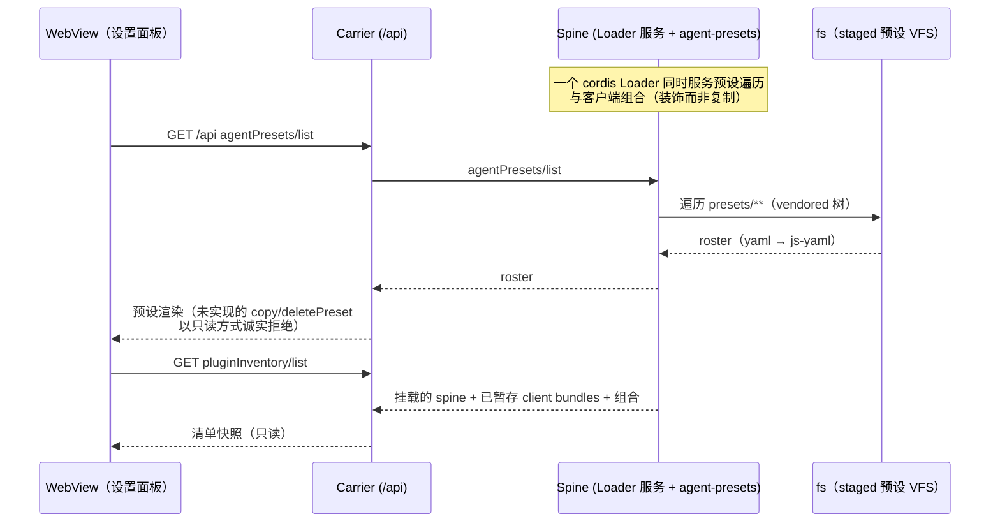
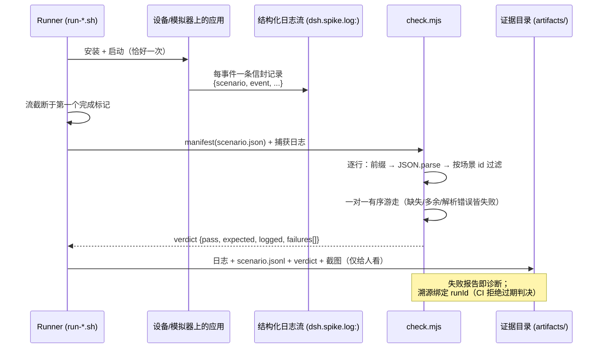
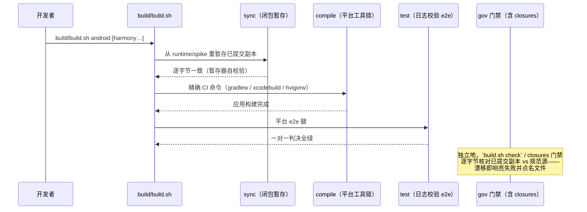

# 时序图 —— 全流程端到端

[English](sequence-diagrams.md) | 简体中文

构成 dsh-mobile 的十个流程，全部以时序图呈现。参与者即架构的五层
（ARCHITECTURE.md §2）：**UI**（渲染 Web Client 的 WebView）、**carrier**
（应用内回环 HTTP/WS 服务）、**spine**（承载 vendored 上游 DSH 核心的
QuickJS 运行时，单一串行线程）、**网关**（冻结的原语表 + 审计）、
**原生特权层**（Swift / Kotlin / ArkTS+NAPI）。每张图同时标注结构化日志
记录落在哪里——它们正是 e2e 校验器断言的证据。

## 1. 应用启动与官方 Web 客户端挂载

证据：`boot.verification`（7 事件）、`officialweb.mount`（14 事件）、
`hosts/
/artifacts/` 下各阶段截图。

## 2. 一次网关原语调用（以 fsWrite 为例）

## 3. 能力协商（RuntimeDescriptor）

## 4. 实时 LLM 流式会话

证据：`llm.live-stream`（含 `.device` 腿）：服务模型逐字记录、推理+正文
为事件序列、密钥泄露审计被断言。

## 5. 会话持久化与恢复

## 6. 插件安装即回执事务

证据：`install.verified-tarball`（22/22）、`install.full-cycle`（41/41）、
`install.from-http`（46/46）。

## 7. ishRun —— 模拟用户land，含每次引导完整性校验

证据：`userland.shell`（11/11 + 交付物摘要），以及 `run-ish-local.sh`
中新增的篡改拒绝案例。

## 8. 设置面板 —— 预设与插件清单

证据：`settings.surfaces`（CLI，一对一）。

## 9. E2E 验证 —— 日志而非截图

## 10. 构建门面

## 阅读指南

- 流程 1–8 是运行时行为；9–10 是让它们保持诚实的验证与构建机制。
- 每条"日志"注记都是校验器可断言的真实记录；每张图至少对应
  ARCHITECTURE.md §10 验证阶段表中的一个具名场景。
- 唯一刻意的平台不对称（流程 7）经协商表达，绝无分支。
